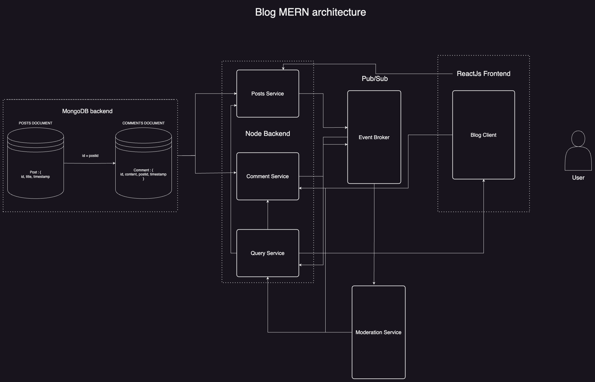

# Blog
**MERN Stack Learning**

  <h2>This is a simple blog application built with the MERN stack.</h2>

  

  
The application uses a MongoDB backend with which the posts and comments services interact.

  
Data transfer happens through an event broker and a query service.

  
The application also uses a moderation service to filter out comments that might be inappropriate.

<h3 style="color: #90caf9;">Features</h3>
<ul>
  <li>Create posts</li>
  <li>Comment on posts</li>
  <li>Moderate comments</li>
</ul>

<h3 style="color: #90caf9;">Technologies Used</h3>
<ul>
  <li>MongoDB</li>
  <li>Express</li>
  <li>React</li>
  <li>Node.js</li>
</ul>

<h3 style="color: #90caf9;">Services</h3>
<ul>
  <li>Post Service</li>
  <li>Comment Service</li>
  <li>Event Broker</li>
  <li>Query Service</li>
  <li>Moderation Service</li>
</ul>

<h3 style="color: #90caf9;">Setup</h3>
<ol>
  <li>Clone the repository</li>
  <li>Install dependencies using <code>npm install</code> in each service folder</li>
  <li>Start the services using <code>npm start</code> in each service folder</li>
</ol>

  
The application uses a MongoDB backend with which the posts and comments services interact.

  
Data transfer happens through an event broker and a query service.

  
The application also uses a moderation service to filter out comments that might be inappropriate.

<h3 style="color: #90caf9;">Docker and Kubernetes</h3>

The services are dockerized and run in Kubernetes pods. Follow the instructions below to deploy the application in a Kubernetes cluster.

<h4 style="color: #f48fb1;">1. Dockerize Services</h4>

Each service has its own Dockerfile. Build the Docker images by navigating to each service directory and running:

<pre style="background: #2d2d2d; color: #ffffff; padding: 1em;">
<code>docker build -t &lt;your-dockerhub-username&gt;/&lt;service-name&gt;:tag .</code>
</pre>

<h4 style="color: #f48fb1;">2. Push Images to Docker Hub</h4>

Push the built images to Docker Hub:

<pre style="background: #2d2d2d; color: #ffffff; padding: 1em;">
<code>docker push &lt;your-dockerhub-username&gt;/&lt;service-name&gt;:tag</code>
</pre>

<h4 style="color: #f48fb1;">3. Deploy to Kubernetes</h4>

Ensure you have <code>kubectl</code> and <code>skaffold</code> installed. Create the necessary Kubernetes deployment and service files. Here’s an example for MongoDB:

<pre style="background: #2d2d2d; color: #ffffff; padding: 1em;">
<code>
# mongo-deployment.yaml
apiVersion: apps/v1
kind: Deployment
metadata:
  name: mongodb
spec:
  replicas: 1
  selector:
    matchLabels:
      app: mongodb
  template:
    metadata:
      labels:
        app: mongodb
    spec:
      containers:
        - name: mongodb
          image: mongo:latest
          ports:
            - containerPort: 27017
---
apiVersion: v1
kind: Service
metadata:
  name: mongodb
spec:
  selector:
    app: mongodb
  ports:
    - protocol: TCP
      port: 27017
      targetPort: 27017
</code>
</pre>

Apply the Kubernetes configurations:

<pre style="background: #2d2d2d; color: #ffffff; padding: 1em;">
<code>kubectl apply -f mongo-deployment.yaml
kubectl apply -f mongo-pvc.yaml
kubectl apply -f mongo-service.yaml</code>
</pre>

<h4 style="color: #f48fb1;">4. Start Services with Skaffold</h4>

Navigate to the root directory of the project and run:

<pre style="background: #2d2d2d; color: #ffffff; padding: 1em;">
<code>skaffold dev</code>
</pre>

This command will start all the services defined in your Kubernetes manifests and keep them updated as you make changes to your code.

<h3 style="color: #90caf9;">Additional Setup Information</h3>
<ol>
  <li>Ensure Docker and Kubernetes are properly installed and configured on your machine.</li>
  <li>Create a Kubernetes cluster using Minikube, Docker Desktop, or any other Kubernetes solution.</li>
  <li>Configure Skaffold to watch your services and rebuild/redeploy them on code changes.</li>
</ol>

  <h3 style="color: #f48fb1;">Happy Coding!</h3>

